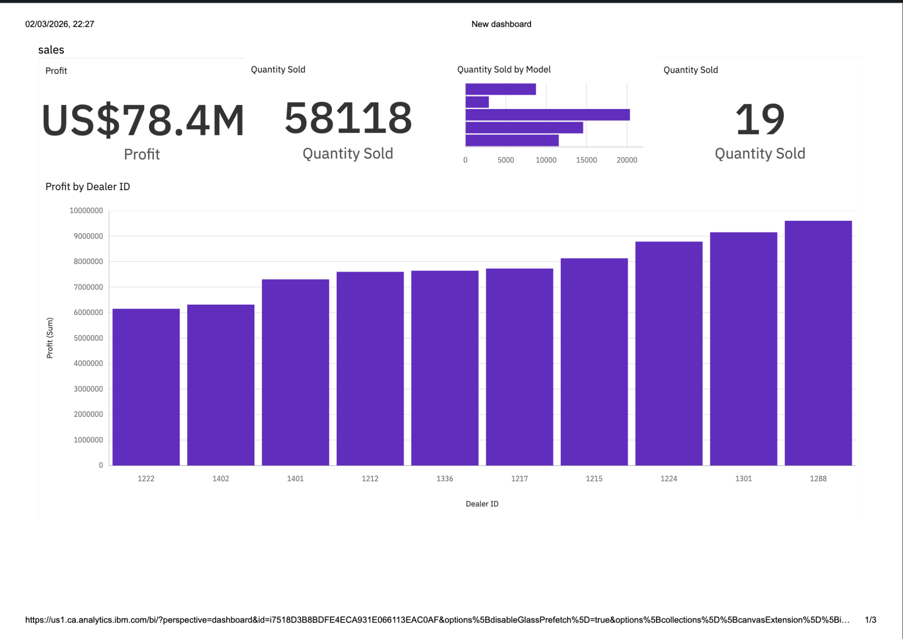
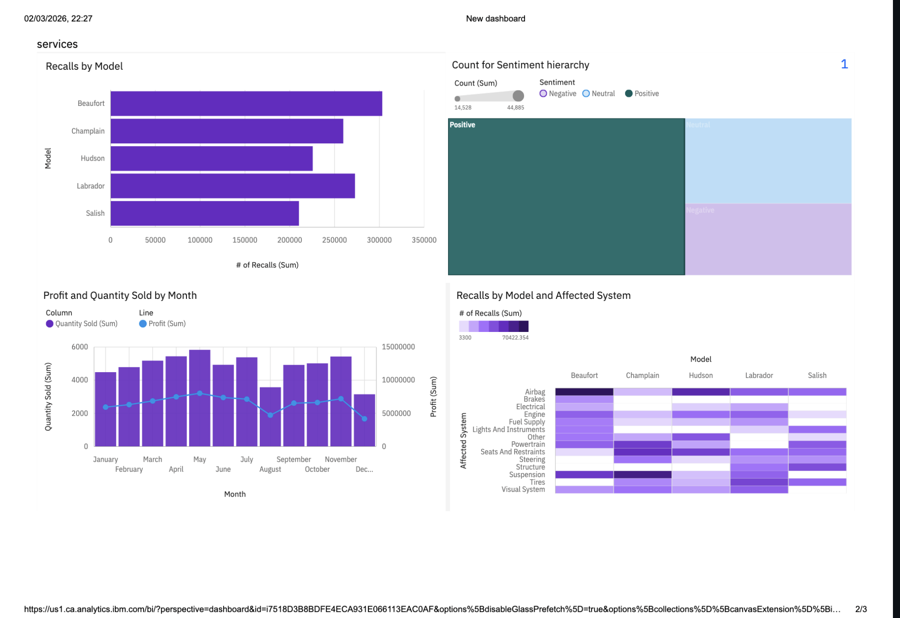
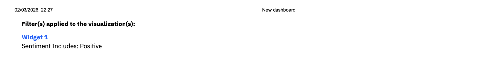
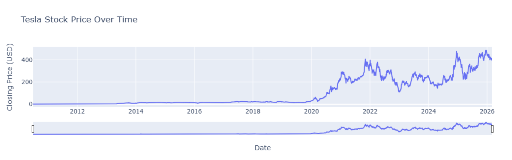
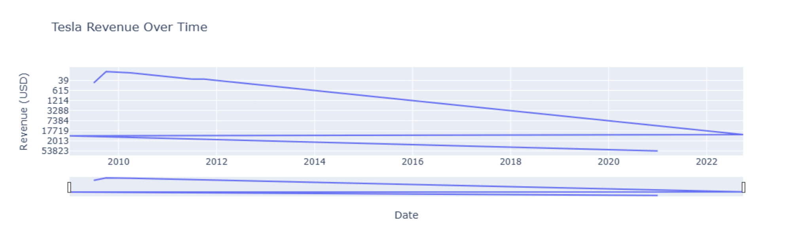
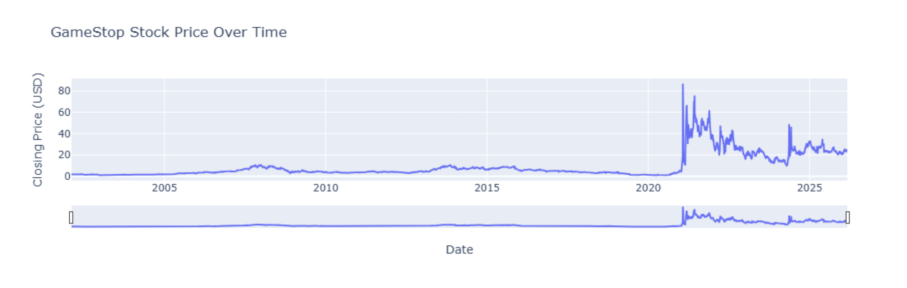
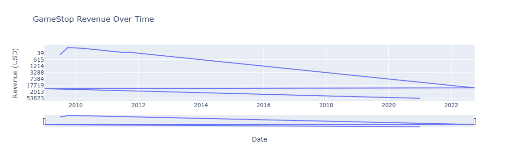

# Automotive Sales Trend Analysis

Automotive Sales Trend Analysis is a data analytics project focused on understanding vehicle sales performance, model-level trends, and business insights using Excel-based data, Python analysis, and dashboard reporting.

The project is built as an end-to-end analytics case study with data exploration, sales trend analysis, dashboard visuals, and business-focused interpretation for automotive sales performance.

## Live Demo

Not deployed. This project is presented through a Jupyter Notebook, Excel dataset, PDF dashboard, and visual screenshots.

## Preview

### Dashboard Screens

| Sales Overview | Model Performance |
|---|---|
|  |  |

| Sales Trend | Category Insights |
|---|---|
|  |  |

| Dashboard View | Business Insights |
|---|---|
|  |  |

| Final Dashboard |
|---|
|  |

## Project Highlights

- Analyzes automotive sales performance across different car models.
- Uses Excel sales data as the main dataset.
- Explores model-level sales trends and performance patterns.
- Includes a Jupyter Notebook for data analysis.
- Includes a dashboard PDF for visual reporting.
- Provides screenshot previews of the dashboard.
- Helps identify top-performing models and sales behavior.
- Demonstrates practical data analytics workflow for business reporting.
- Suitable for fresher-level Data Analyst portfolio presentation.

## Tech Stack

- Python
- Pandas
- Jupyter Notebook
- Excel
- Data Cleaning
- Data Analysis
- Dashboard Reporting
- PDF Dashboard
- Data Visualization

## Dataset

The included dataset is:

```text
CarSalesByModelEnd.xlsx.xlsx
```

The dataset contains automotive sales information by car model and is used to analyze sales performance, trends, and model-wise business insights.

## Main Files

```text
CarSalesByModelEnd.xlsx.xlsx       Automotive sales dataset
Stock_Analysis_Assignment.ipynb    Jupyter Notebook with analysis workflow
New dashboard.pdf                  Dashboard report/export
README.md                          Project documentation
s1.png                             Dashboard screenshot
s2.png                             Dashboard screenshot
s3.png                             Dashboard screenshot
s4.png                             Dashboard screenshot
s5.png                             Dashboard screenshot
s6.png                             Dashboard screenshot
s7.png                             Dashboard screenshot
```

## Analysis Approach

The project follows a standard data analytics workflow:

1. Load the automotive sales dataset
2. Review columns, structure, and data quality
3. Clean and prepare the data for analysis
4. Explore sales patterns by model
5. Identify top-performing and low-performing models
6. Create visual summaries and dashboard views
7. Export dashboard/report visuals
8. Document key findings for business interpretation

## Main Features

### Sales Performance Analysis

The project analyzes car sales data to understand how different models perform over time and across sales categories.

### Model-Level Insights

The analysis helps identify which car models show stronger sales performance and which models may need additional business attention.

### Dashboard Reporting

The project includes a dashboard PDF and image previews to make the results easy to understand for recruiters, analysts, and business users.

### Visual Storytelling

The screenshots provide a quick view of sales trends, performance comparisons, and dashboard-level summaries.

## Project Structure

```text
automotive_sales_trend_analysis/
├── CarSalesByModelEnd.xlsx.xlsx
├── New dashboard.pdf
├── README.md
├── Stock_Analysis_Assignment.ipynb
├── s1.png
├── s2.png
├── s3.png
├── s4.png
├── s5.png
├── s6.png
└── s7.png
```

## Setup

Clone the repository:

```bash
git clone https://github.com/Sagnik0910/automotive_sales_trend_analysis.git
cd automotive_sales_trend_analysis
```

Install required Python libraries if needed:

```bash
pip install pandas matplotlib seaborn openpyxl jupyter
```

Open the notebook:

```bash
jupyter notebook Stock_Analysis_Assignment.ipynb
```

## How To View The Dashboard

Open the dashboard PDF:

```text
New dashboard.pdf
```

Or view the screenshots directly in the repository:

```text
s1.png
s2.png
s3.png
s4.png
s5.png
s6.png
s7.png
```

## Example Use Cases

- Automotive sales performance analysis
- Model-wise sales trend reporting
- Business dashboard creation
- Excel dataset analysis
- Data analyst portfolio project
- Exploratory data analysis practice
- Dashboard storytelling practice

## Current Limitations

- The project is not deployed as a web dashboard.
- The analysis depends on the available Excel dataset.
- Dashboard interactivity is limited because the final dashboard is exported as PDF/images.
- More advanced forecasting can be added in future versions.

## Future Improvements

- Add interactive dashboard using Power BI, Tableau, or Streamlit.
- Add more detailed business insights in the notebook.
- Add monthly or yearly trend forecasting.
- Include more visual charts for model comparison.
- Clean the dataset filename for better readability.
- Add SQL-based analysis queries.
- Add an executive summary section.

## Author

Sagnik Guha

GitHub: [Sagnik0910](https://github.com/Sagnik0910)
